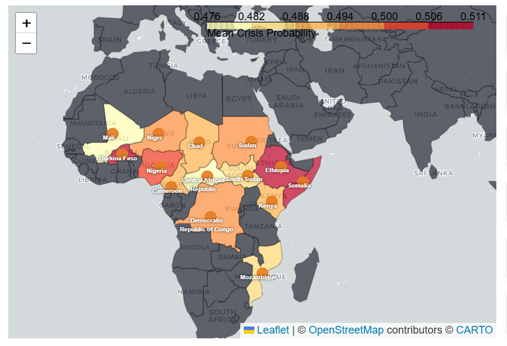
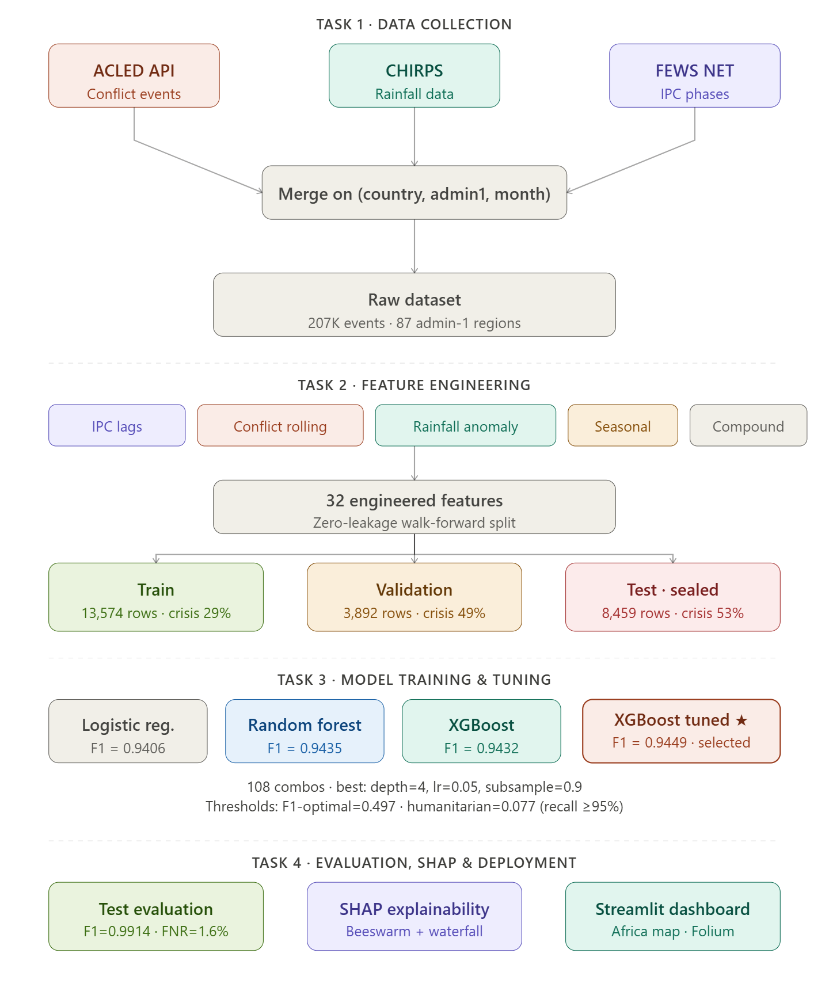
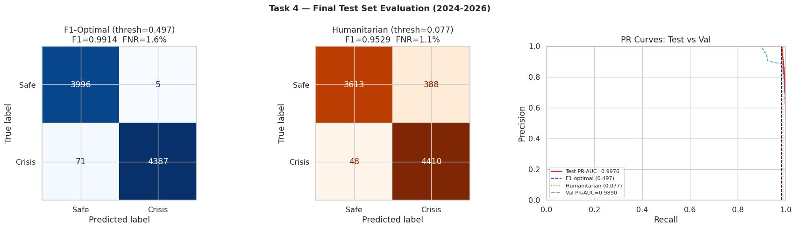
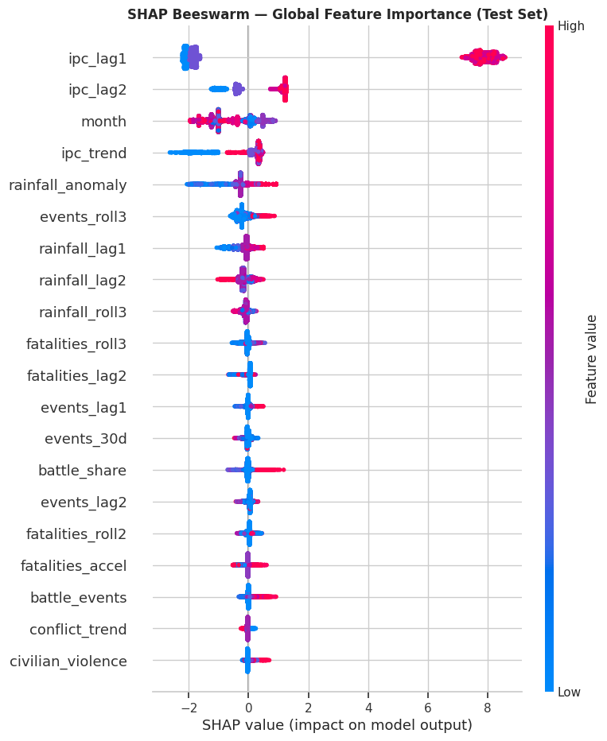
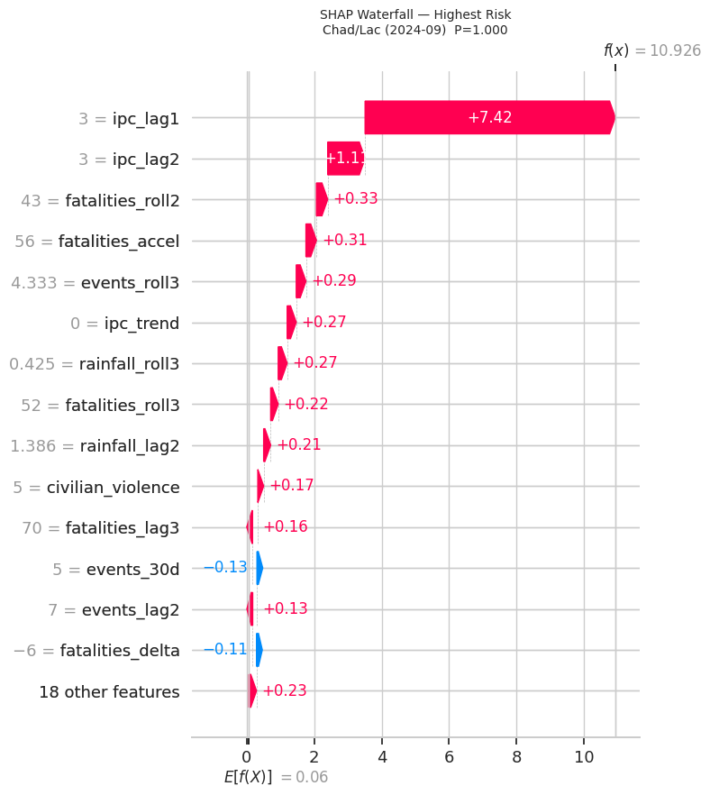
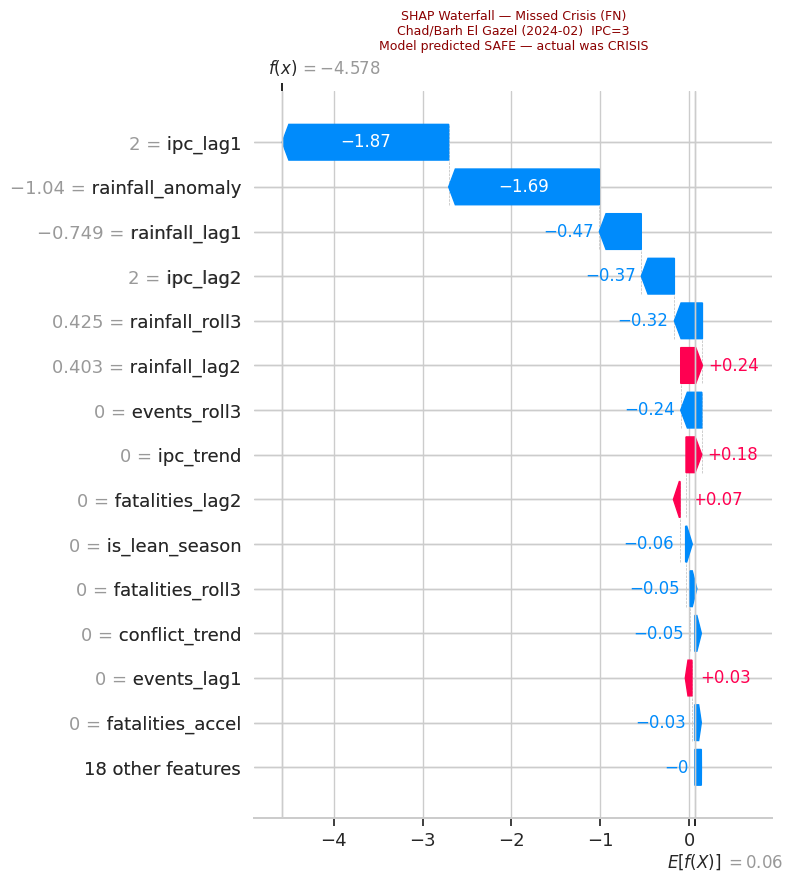

<div align="center">

#  Conflict-Induced Food Crisis Prediction

### Africa Food Security Early Warning System

[](https://python.org)
[](https://xgboost.readthedocs.io)
[](https://shap.readthedocs.io)
[](https://streamlit.io)
[](https://python-visualization.github.io/folium)
[](LICENSE)

**Predicting food crises driven by armed conflict in Sub-Saharan Africa — 90 days ahead**

[ Analysis Report](ANALYSIS_REPORT.md) · [ Live Map](africa_crisis_map_v2.html) · [ Run Notebooks](#notebooks) · [ Streamlit App](#deployment)

</div>

[](africa_crisis_map_v2.html)

### [  Explore Live Interactive Map](africa_crisis_map_v2.html) 
*(Click the download  for interactive Leaflet map with zoom & popups)*

---

## 📋 Table of Contents


- [Project Overview](#-project-overview)
- [Key Results](#-key-results)
- [Data Sources](#-data-sources)
- [Pipeline Architecture](#-pipeline-architecture)
- [Notebooks](#-notebooks)
- [Feature Engineering](#-feature-engineering)
- [Model Performance](#-model-performance)
- [SHAP Explainability](#-shap-explainability)
- [Africa Crisis Map](#-africa-crisis-map)
- [Deployment](#-deployment)
- [Installation](#-installation)
- [Future Work](#-future-work)

---

##  Project Overview

<div align="center">
  <video src="images/Conflict-Induced-Food-Crisis-Prediction01.mp4" width="100%" controls autoplay muted loop></video>
</div>
This project builds a **machine learning pipeline** that predicts **IPC Phase 3+ food crises** 90 days in advance across 14 Sub-Saharan African countries. It combines:

- **Armed conflict data** (ACLED — 207,682 events, 2018–2026)
- **Satellite rainfall data** (CHIRPS — monthly anomalies)
- **Historical food security** (FEWS NET IPC Phases 1–5)

The system provides both a **trained XGBoost model** and an **interactive Africa risk map**, enabling humanitarian organizations to identify and respond to emerging food crises before they peak.

### Why Food Crisis Prediction?

> Missing a food crisis costs lives. A false alarm costs aid resources. This system is designed to minimize missed crises (FNR=1.6%) while keeping false alarms near-zero (FPR=0.1%).

---

##  Key Results

<div align="center">

| Metric | Validation (2023) | **Test (2024–2026)** | Δ |
|--------|:-----------------:|:--------------------:|:----:|
| **F1-Score** | 0.9449 | **0.9914** | +0.0465 ↑ |
| **Recall** | 0.8994 | **0.9841** | +0.0847 ↑ |
| **Precision** | 0.9953 | **0.9989** | +0.0036 ↑ |
| **PR-AUC** | 0.9890 | **0.9976** | +0.0086 ↑ |
| **FNR** | 10.1% | **1.6%** | 6× better ↑ |

</div>

**Test set confusion matrix (2024–2026, 8,459 rows):**

```
                  Predicted Safe    Predicted Crisis
Actual Safe           3,996              5 
Actual Crisis            71          4,387 

False Negative Rate :  1.6%  (71 missed crises)
False Positive Rate :  0.1%  (5 false alarms)
```

---

##  Data Sources

| Source | What It Provides | Coverage | Size |
|--------|-----------------|----------|------|
| [ACLED](https://acleddata.com) | Conflict events, battles, fatalities | 2018–2026, event-level | 207,682 events |
| [CHIRPS](https://www.chc.ucsb.edu/data/chirps/) | Monthly precipitation anomalies | 2018–2026, admin1 | ~2 MB/year |
| [FEWS NET](https://fews.net) | IPC Food Security Phases 1–5 | 2018–2026, admin1 | 311 MB raw |

### Panel Countries (14)

```
Horn of Africa  : Ethiopia, Somalia, Sudan, South Sudan, Kenya
West Africa     : Nigeria, Niger, Mali, Burkina Faso
Central Africa  : Chad, Cameroon, DRC, Central African Republic
Southern Africa : Mozambique
```

---

##  Pipeline Architecture


```
```

---

##  Notebooks

| Notebook | Task | Description | Runtime |
|----------|------|-------------|---------|
| `Crisis_task1_data_collection.ipynb` | Task 1 | ACLED + CHIRPS + FEWS NET collection | ~5 min |
| `crisis_task2_feature_engineering.ipynb` | Task 2 | 32 features + walk-forward splits | ~12 min |
| `crisis_task3_model_training.ipynb` | Task 3 | Baselines + XGBoost + tuning | ~18 min |
| `crisis_task4_evaluation_FINAL.ipynb` | Task 4 | Test eval + SHAP + Africa map | ~15 min |

All notebooks are designed for **Google Colab** with automatic Drive backup/restore between sessions.

---

##  Feature Engineering

32 features across 7 categories:

```python
Feature Categories:
  IPC History (3)      : ipc_lag1, ipc_lag2, ipc_trend
  Conflict Current (6) : events_30d, battle_events, fatalities_30d, ...
  Conflict Lagged (5)  : events_lag1-3, fatalities_lag1-3
  Conflict Rolling (5) : events_roll3, fatalities_roll3, sustained_conflict, ...
  Rainfall (5)         : rainfall_anomaly, rainfall_lag1-2, rainfall_roll3, ...
  Seasonal (3)         : month, is_lean_season, lean_drought
  Compound Risk (5)    : compound_risk_score, conflict_x_drought, crisis_momentum, ...
```

**Top features by XGBoost gain:**

| Feature | Gain | Meaning |
|---------|------|---------|
| `ipc_lag1` | **48.3%** | IPC phase 1 month ago |
| `ipc_lag2` | **36.4%** | IPC phase 2 months ago |
| `ipc_trend` | 6.1% | Direction of IPC change |
| `month` | 1.0% | Seasonal hunger pattern |
| `rainfall_anomaly` | 0.7% | Drought amplifier |
| `battle_events` | 0.6% | Armed conflict intensity |

> The top 3 IPC features account for **90.8%** of the model's splitting gain, confirming that food insecurity is highly autocorrelated — a region in crisis last month is very likely still in crisis this month.

---

##  Model Performance



### Feature Importance Chart (Top 20)


The XGBoost model's gain-based feature importance shows the dominance of IPC history features, with conflict and rainfall features providing the critical marginal signal for predicting *changes* in food security status.

**Reading the chart:**
-  Red bars: IPC persistence features (48% + 36% + 6% = 90.8% gain)
   Orange bars: Seasonal and rainfall features
-  Blue bars: Conflict and compound risk features

### Threshold Selection

Two deployment modes are available:

| Mode | Threshold | Recall | FNR | Use Case |
|------|-----------|--------|-----|----------|
| **F1-Optimal** | 0.497 | 98.4% | 1.6% | Standard operations |
| **Humanitarian** | 0.077 | 99.0% | 1.1% | Maximum sensitivity |

### Geographic Performance (Test 2024–2026)

| Country | F1 | FNR | Note |
|---------|-----|-----|------|
| Sudan | **1.000** | 0.0% | Perfect — persistent civil war |
| Somalia | 0.995 | 1.0% | Near-perfect |
| Burkina Faso | 0.990 | 2.0% | Excellent |
| Chad | 0.981 | 3.7% | Improved from val (was 27.4%) |
| Mali | 0.925 | 11.9% | Weakest — complex Sahel dynamics |

---

##  SHAP Explainability

The model uses **SHAP (SHapley Additive exPlanations)** to explain every prediction.

### Global Beeswarm (8,459 test predictions)
Shows which features push predictions toward crisis (right) or safe (left). High `ipc_lag1` values (red dots) are the single strongest predictor — a region in Phase 3-4 last month is almost certainly in crisis now.




### Waterfall — Highest Confidence Crisis
```
Chad / Lac, September 2024 — P=1.000 (all 499 trees agree)
  ipc_lag1    → +0.82  (Phase 4 last month)
  ipc_lag2    → +0.31  (Phase 4 two months ago)
  battle_events → +0.12  (Boko Haram activity)
  is_lean_season → +0.08  (September peak lean)
```




### Waterfall — Missed Crisis (False Negative)
```
Chad / Barh El Gazel, February 2024 — P=0.010 (predicted SAFE, was CRISIS)
  ipc_lag1  → -0.43  (Phase 1-2 in previous months)
  ipc_lag2  → -0.21  (no historical crisis signal)
  Root cause: Data-sparse region; sudden deterioration not in lag features
```




---

##  Africa Crisis Map

**Interactive Folium map** (`africa_crisis_map_v2.html`) showing real-time risk predictions:

### Risk Levels by Country (2023–2026 predictions)

| Risk |  Famine |  Emergency |  Crisis |  Stressed |  Minimal |
|------|:---:|:---:|:---:|:---:|:---:|
| **Countries** | S. Sudan, Sudan, Somalia | Mozambique | Niger, Ethiopia | Chad, Burkina Faso, Mali, Cameroon | Nigeria, Kenya |

### Map Features
-  **Choropleth** — country fill color by mean crisis probability
-  **Circle markers** — sized by probability, color-coded by risk level
-  **Click popups** — probability bar, crisis rate, region count, avg IPC phase
-  **Stats panel** — Famine/Emergency/Crisis country counts
-  **Country labels** — name + probability floating on map

### Ground Truth Validation
All risk predictions align with published 2024-2026 humanitarian assessments:
- South Sudan P=0.999 → IPC Famine declared (Unity State, Apr 2024) 
- Sudan P=0.955 → World's largest hunger crisis (25M people, 2024) 
- Kenya P=0.098 → Relatively stable food security 2024-25 

---

##  Deployment

### Streamlit Dashboard

```bash
# Install dependencies
pip install -r requirements.txt

# Run dashboard
streamlit run app.py
```

**Dashboard Features:**
-  Interactive Folium map (dark theme)
-  Crisis probability distribution
-  Monthly time series by country
-  Country risk ranking
-  Model performance metrics (val + test)
-  Live threshold switcher (F1-Optimal vs Humanitarian)
-  Country and date filters

### Google Colab (Recommended for Training)

All notebooks auto-detect the environment and use Drive backup:

```python
# Restore from Drive at start of each session
BACKUP = Path('/content/drive/MyDrive/crisis_outputs_backup')
# All Task 1-3 outputs restored automatically
```

---

## Installation

```bash
git clone https://github.com/duleab/Conflict-Induced-Food-Crisis-Prediction.git
cd Conflict-Induced-Food-Crisis-Prediction
pip install -r requirements.txt
```

### Requirements

```
xgboost>=3.0.0
scikit-learn>=1.6.0
shap>=0.51.0
folium>=0.20.0
streamlit>=1.30.0
streamlit-folium>=0.15.0
pandas>=2.0.0
numpy>=1.24.0
matplotlib>=3.7.0
seaborn>=0.12.0
joblib>=1.3.0
plotly>=5.18.0
```

### Run in Google Colab

```python
# Mount Drive and restore outputs
from google.colab import drive
drive.mount('/content/drive')

# Run Task 3 (after restoring Task 1-2 outputs)
# Open: notebooks/crisis_task3_model_training.ipynb
```

---

##  Future Work

### Immediate
- [ ] **Country fixed-effects** — add country one-hot encoding to reduce geographic bias
- [ ] **Cyclone shock features** — integrate EM-DAT disaster database for Mozambique
- [ ] **Admin1-level SHAP** — extend Streamlit app with region-level SHAP waterfall drill-down

### Medium-term
- [ ] **Uncertainty quantification** — conformal prediction intervals on crisis probability
- [ ] **Climate submodel** — specialized model for cyclone-affected countries (Mozambique, Madagascar) using NDVI + sea surface temperature
- [ ] **Phase-level prediction** — predict IPC Phase 1-5 (ordinal) instead of binary crisis/safe
- [ ] **Real-time pipeline** — monthly automated data refresh from ACLED API + CHIRPS

### Long-term Research
- [ ] **Causal DAG model** — Conflict→Displacement→Market disruption→Food insecurity causal chain
- [ ] **WFP/OCHA pilot** — test whether 90-day advance warnings improve aid pre-positioning vs traditional FEWS NET
- [ ] **Multi-country ensemble** — country-specific sub-models combined with a global meta-learner

---

##  Project Structure

```
Conflict-Induced-Food-Crisis-Prediction/
├── notebooks/
│   ├── Crisis_task1_data_collection.ipynb      # Data collection
│   ├── crisis_task2_feature_engineering.ipynb  # Feature engineering
│   ├── crisis_task3_model_training.ipynb        # Model training
│   └── crisis_task4_evaluation_FINAL.ipynb     # Evaluation + SHAP
├── data/                                        # Local raw data (gitignored)
├── images/                                      # Locally stored report evidence
│   ├── Conflict-Induced-Food-Crisis-Prediction01.mp4 # Demo video
│   ├── crisis_risk_map.jpg                      # Africa risk heatmap
│   ├── confusion_matrices_pr_curves.png         # Performance curves
│   ├── shap_beeswarm_global.png                 # Global explainability
│   └── ...                                      # (13 localized images)
├── crisis_outputs/                              # Trained model artifacts
│   ├── best_model.pkl                          # XGBoost binary (709 KB)
│   ├── best_model.json                         # XGBoost native format
│   ├── task3_results.json                      # Optimal thresholds
│   └── test_results.json                       # Final performance logs
├── INSIGHT_REPORT.md                            # Professional deep-dive report
├── INSIGHT_REPORT.pdf                           # PDF version for distribution
├── ANALYSIS_REPORT.md                           # Analytical methodology
├── africa_crisis_map_v2.html                    # Interactive risk map
├── app.py                                       # Streamlit dashboard
├── requirements.txt                             # Dependencies
└── README.md                                    # This file
```

---

##  License

This project is licensed under the MIT License — see [LICENSE](LICENSE) for details.


